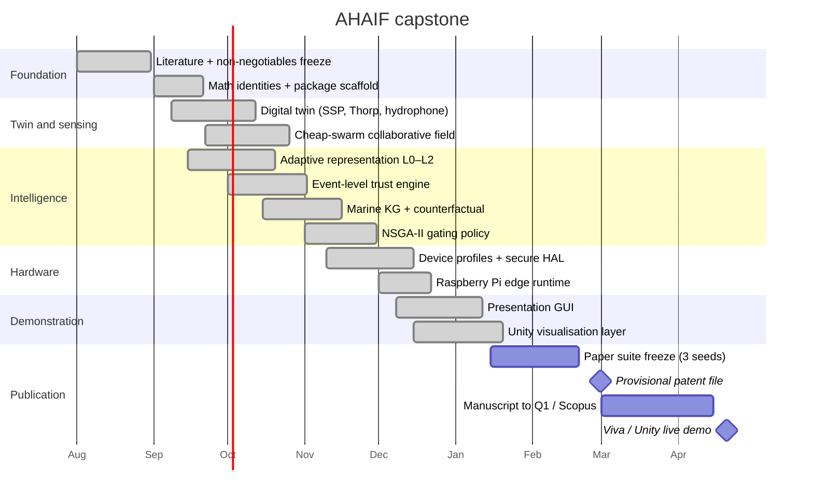
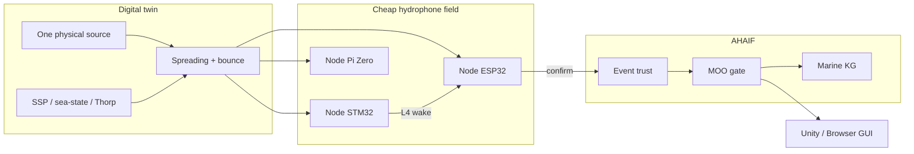
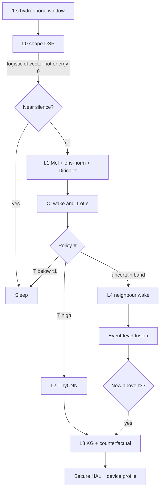
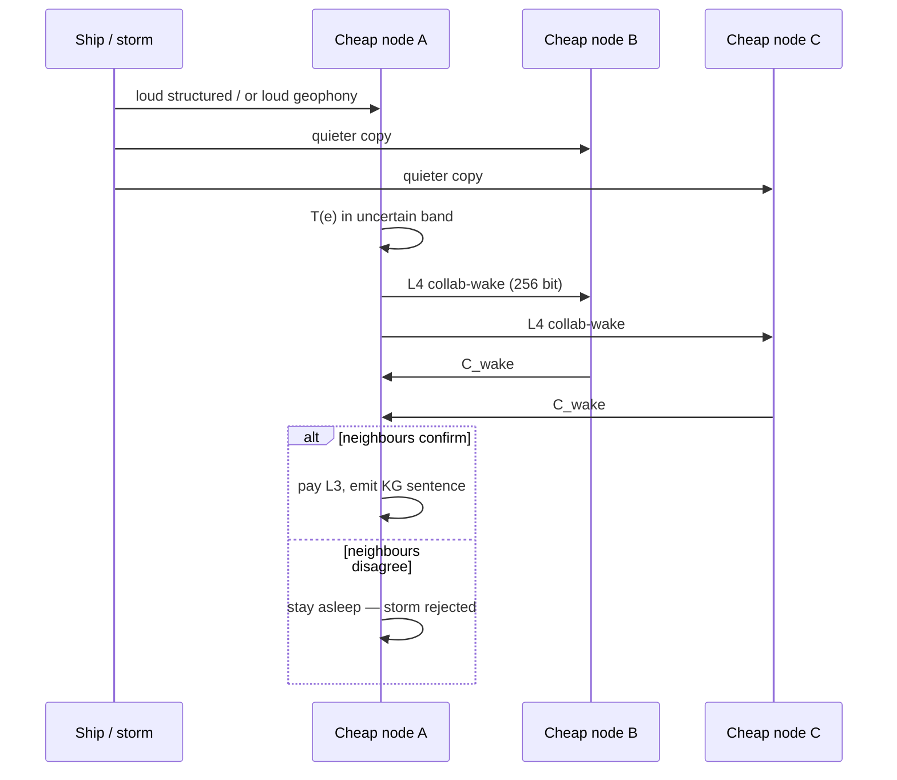
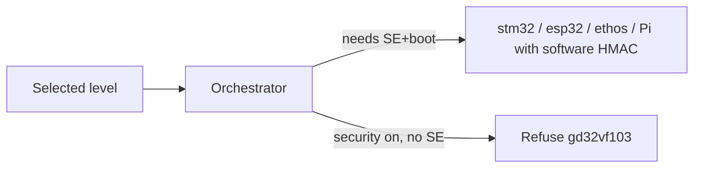

# Diagrams, flowcharts, and Gantt

Use these on slides. They match the running code.

---

## Gantt — capstone (Aug 2026 → Apr 2027)



---

## System context



---

## Per-window pipeline



---

## Swarm specialty (the series of cheap sensors)



This is **not** “A trusts B as a node.” B can be honest and still hear
only wind. Confirmation is of the *event*.

---

## Hardware placement



---

## Work breakdown (WBS)

```
AHAIF
├── Twin (environment, propagate, sensor, network)
├── Swarm field (N cheap nodes, event fusion)
├── Intelligence (φ, trust, KG, policy)
├── Hardware HAL (7 profiles including two Pis)
├── Demo (GUI + Unity JSON)
└── Paper / patent pack
```
